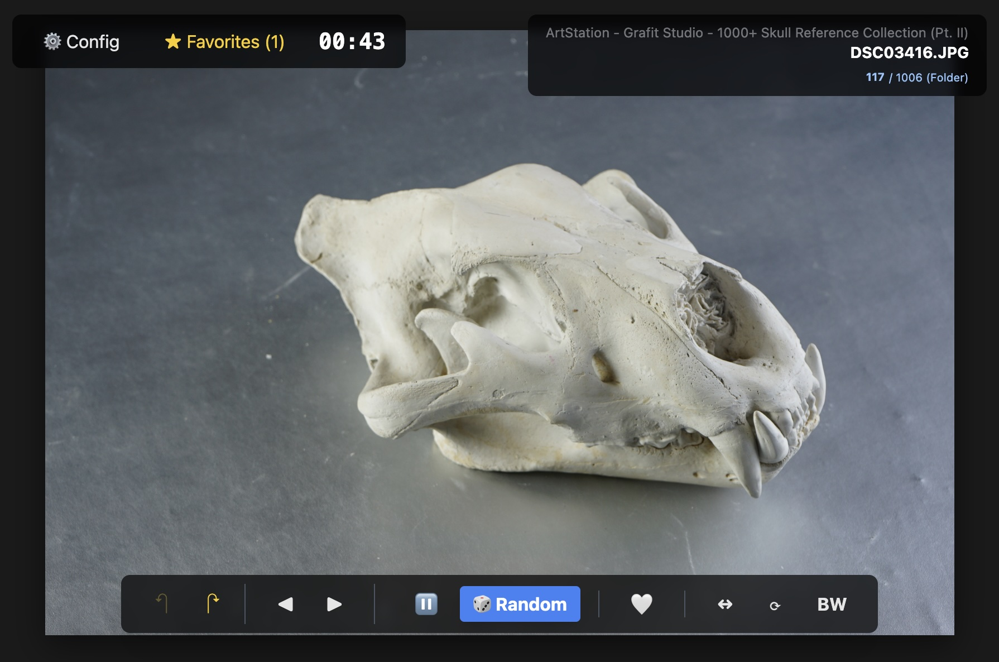

# Drawing Reference Viewer

A lightweight, self-hosted web application for browsing and viewing local drawing references. Designed to help artists practice gesture drawing and studies by turning a local folder structure into a streamlined study tool.



## Features

*   **Smart Randomizer:** Select specific subfolders and instantly load random images for gesture practice.
*   **Deep Zoom & Pan:** Full support for high-resolution images with mouse wheel and touchpad controls.
*   **Image Transformations:** Flip, rotate, and toggle grayscale mode on the fly.
*   **Context Navigation:** Navigate to sibling files within the same folder without leaving the viewer.
*   **Favorites:** Mark images as favorites for quick access later.
*   **Performance:** Server-side caching for handling libraries with thousands of images.

## Tech Stack

*   **Backend:** Python (Flask), Flask-Caching
*   **Frontend:** Vue.js 3, Tailwind CSS

## Installation

1.  Clone the repository:
    ```bash
    git clone https://github.com/yourusername/drawing-app.git
    cd drawing-app
    ```

2.  Install dependencies:
    ```bash
    pip install -r requirements.txt
    ```

3.  Configure the environment:
    *   Create a `.env` file in the root directory (or copy `.env.example`).
    *   Set `BASE_DIR` to the absolute path of your reference library.

    ```env
    BASE_DIR="/path/to/your/references"
    ```

## Usage

1.  Start the application:
    ```bash
    python app.py
    ```

2.  Open your browser at `http://localhost:5000`.

### Keyboard Shortcuts

| Key | Action |
| :--- | :--- |
| `SPACE` | Load Random Image |
| `Arrow Left` / `Right` | Previous / Next Image in Folder |
| `Arrow Up` / `Down` | History Back / Forward |
| `F` | Flip Horizontally |
| `R` | Rotate 90° |
| `G` | Toggle Grayscale |
| `M` | Toggle Favorite |
| `ESC` | Close Menus |

## Deployment

For advanced users running on **Linux**, you can set up the application as a system service using **Gunicorn** and **Nginx** for improved performance and stability.

👉 **[Read the Deployment Guide](docs/DEPLOYMENT.md)**

## License

[MIT](LICENSE)
